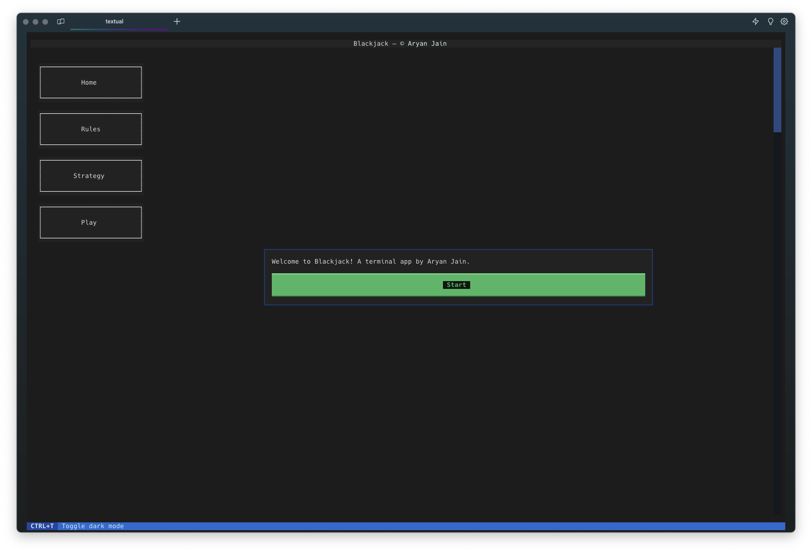
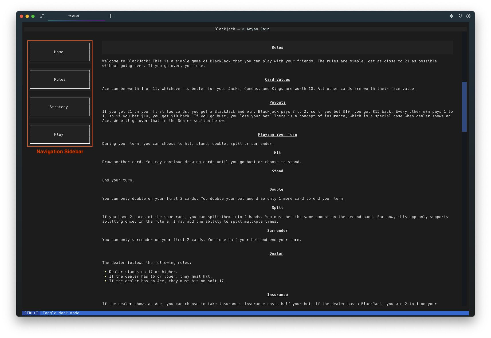
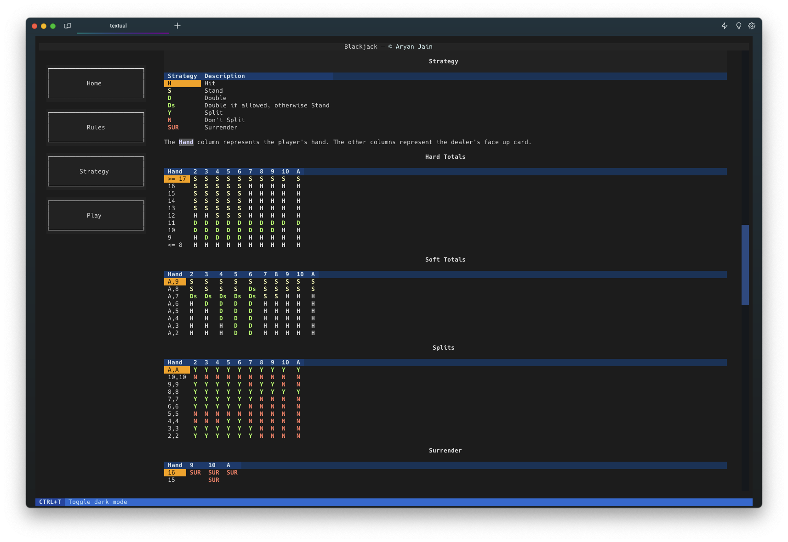
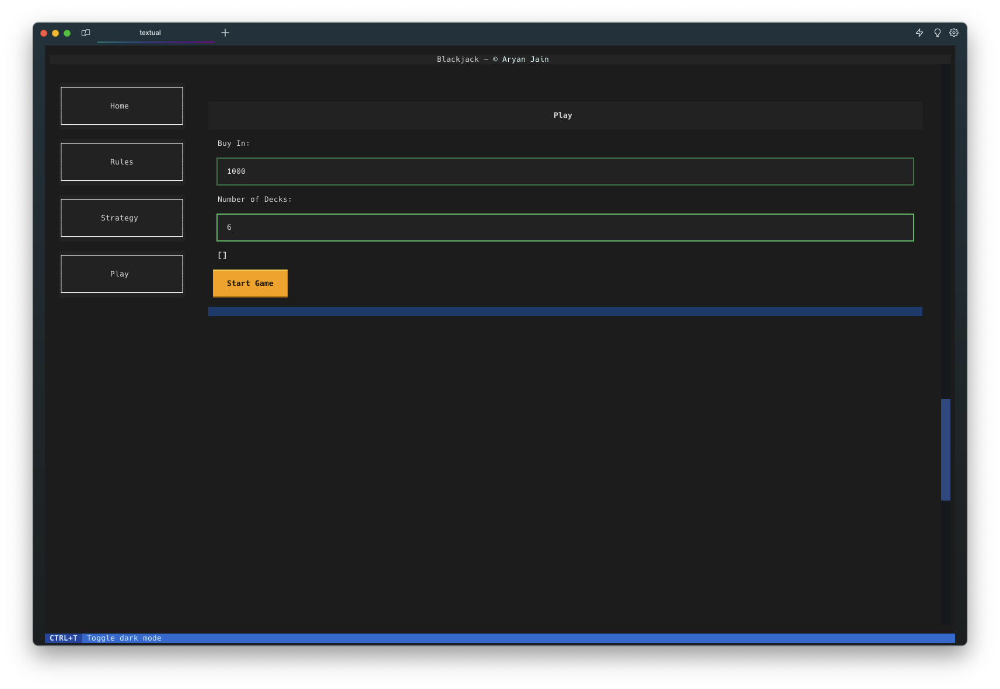
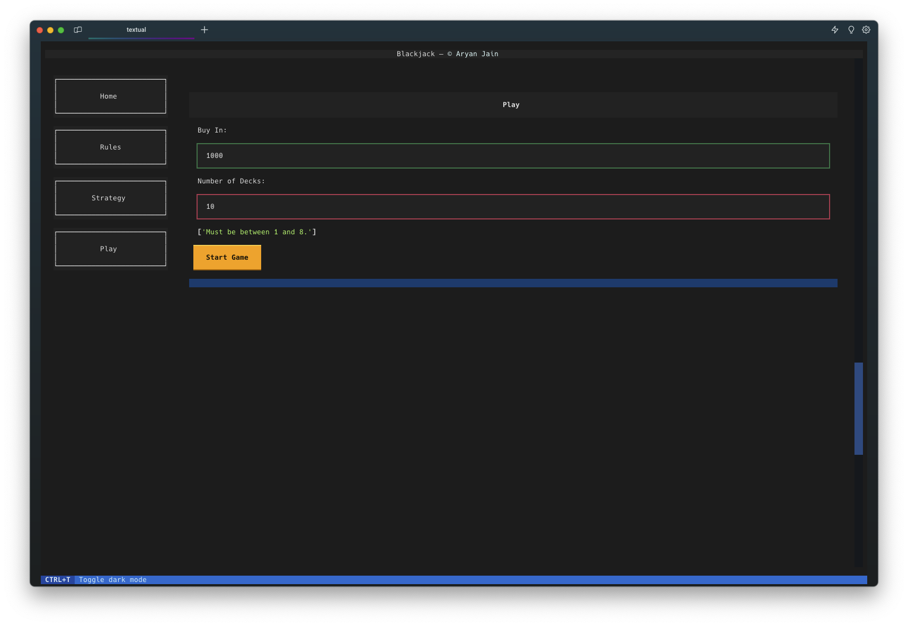
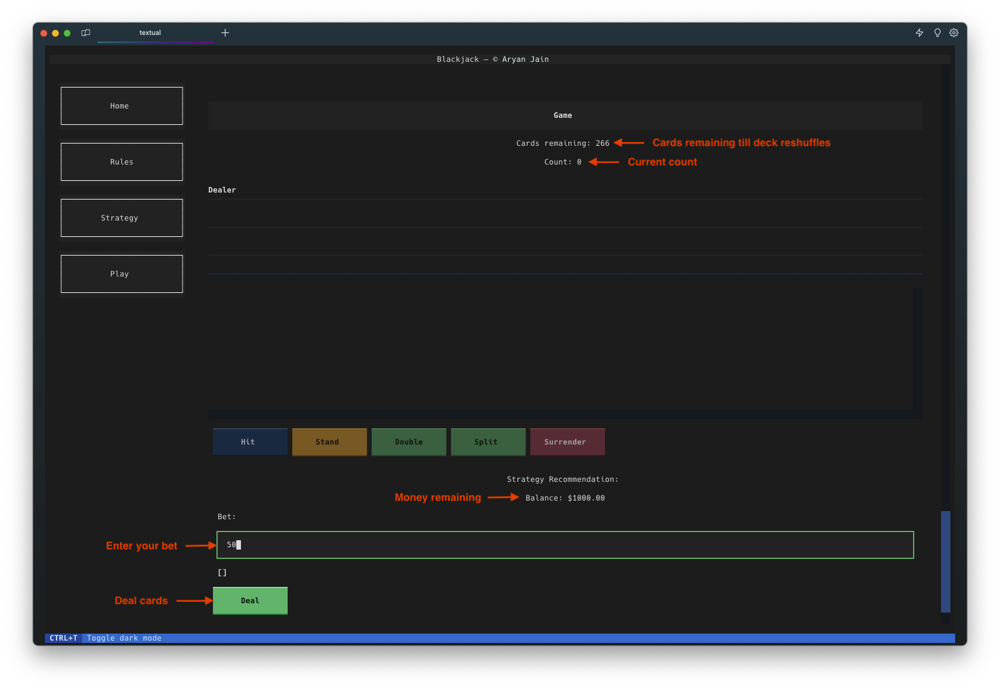
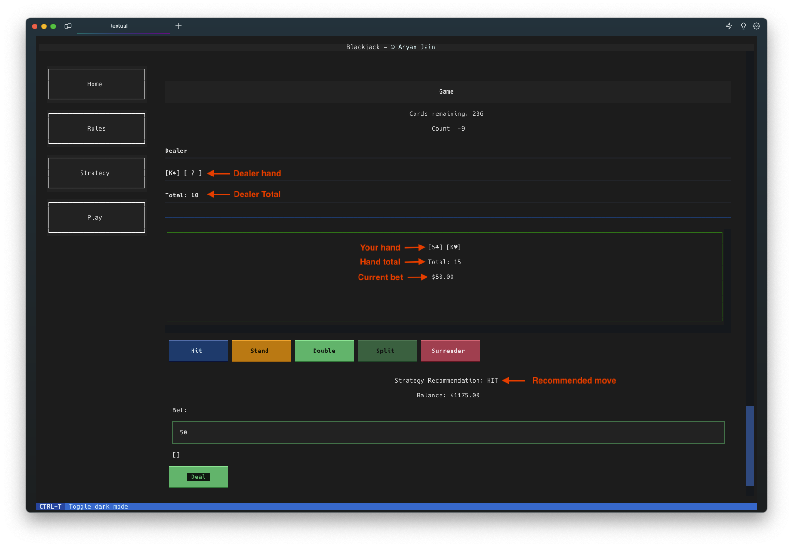
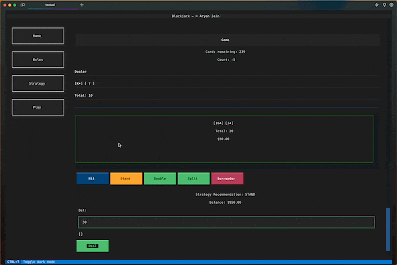

# blackjack
A simple Python blackjack app that will stay true to house odds. This can help you practice and master basic Blackjack strategy, counting cards and experiment with various betting strategies.
This is a lightweight terminal-based Blackjack app with no bloat or ads. Just simple gameplay. The backend was built using [textual](https://github.com/Textualize/textual), a Rapid Application Development framework for Python.

## Installation
>This project requires Python 3.10 or newer.

Clone the repository.
```bash
git clone https://github.com/aryan-jain/blackjack.git
```

If you have [poetry](https://python-poetry.org/) installed, then you should be able to install all dependencies using poetry:
```bash
poetry install
```

If you don't have poetry, then you can also install dependencies using the included `requirements.txt` file:
```bash
pip install -r requirements.txt
```

## Usage
To get started, open up a terminal window. Navigate to the repository directory and run:
```bash
textual run src/app.py
```
You should see the following splash screen within your terminal window:
<p align="center">

</p>

### Navigation
The sidebar on the left will always be visible and will allow you to quickly navigate between the various pages of the app.
You can switch back and forth between `Play`, `Rules` and `Strategy` without losing progress in an active game. 
<p align="center">

</p>

### Strategy
You can nevigate to the `Strategy` page at any time to explore the basic strategy guide.
<p align="center">

</p>

### Creating a game
Hit `Play` on the sidebar to create a new game.
<p align="center">

</p>

You can create a game with `1` to `8` decks of cards. You will see an error if you try to create a game with a different amount of decks. 
<p align="center">

</p>

Hit `Start Game` to begin playing.

### Gameplay
On the top you will see the number of cards remaining till the shoot reshuffles. The house reserves 15% of the shoot till it triggers a reshuffle.
Below that, you will see the current card count. The count follows basic Blackjack card counting strategy and currently does not implement any advanced math to factor in shoot reshuffles. To learn more about card counting, you can visit [Blackjack Apprenticeship](https://www.blackjackapprenticeship.com/how-to-count-cards/). I am not affiliated with them in any way, but they explain card counting well. 

At the bottom of the play area, you will see your current balance.
Your bet can be entered in the `Bet` textbox. It needs to be a multiple of 10 and less than or equal to your current balance. 
Hit `Deal` to begin the round. 
<p align="center">

</p>

When the round starts, you will see the dealer's face up card in the `Dealer` box and your hand below that. 
You will also see the recommended move, below the play area, based on the basic blackjack strategy guide to help you make a decision.
<p align="center">

</p>

When you `Split`, your hand will split into 2 hands, and with each split a new hand will be available if you scroll through the window showing your hand. The active hand will have a green border, your other split hands will have a gray border. The buttons below the play area will correspond to the currently active hand. 
<p align="center"> 
 
</p>